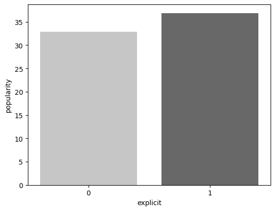

# 🎧 Spotify Music Data Analysis using Python + SQL
### Goal: Discover what makes songs popular on Spotify using data-driven insights.

## 🧠 Project Overview 
- ### Conducted data analysis on Spotify dataset containing more than **89,000 tracks**.
- ### Combined SQL for data extraction & cleaning and Python **(Pandas + Seaborn)** for analysis & visualization.
- ### Explored attributes like **Danceability, Energy, Valence, Tempo, and Explicit content** to understand popularity trends.

## 🛠️ Tech Stack
- ### **SQL** – Data cleaning, Aggregation & Analytical queries
- ### **Python** – Pandas, Seaborn, Matplotlib
- ### **Jupyter Notebook** – Visualization
- ### **MySQL** – Database Integration

## Key Insights 
- ### 💥 Explicit songs show slightly higher average popularity.
- ### ⚡ Optimal tempo range: 120-140 BPM for hit songs.
- ### 👑 Artists with consistent high average popularity (min 10 tracks) tend to dominate specific genres.

## How To Run
- ### Clone Repo 
        git clone https://github.com/Om73922/spotify-data-analytics.git
        cd spotify-data-analytics

- ### install dependencies
        pip install -r requirements.txt

- ### open notebook
        jupyter notebook notebooks/spotify_analysis.ipynb

## Sample Visualization 

